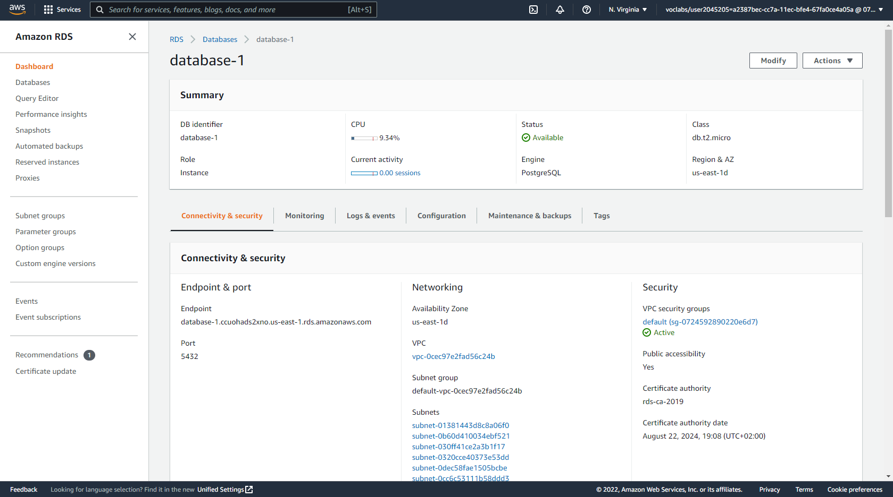
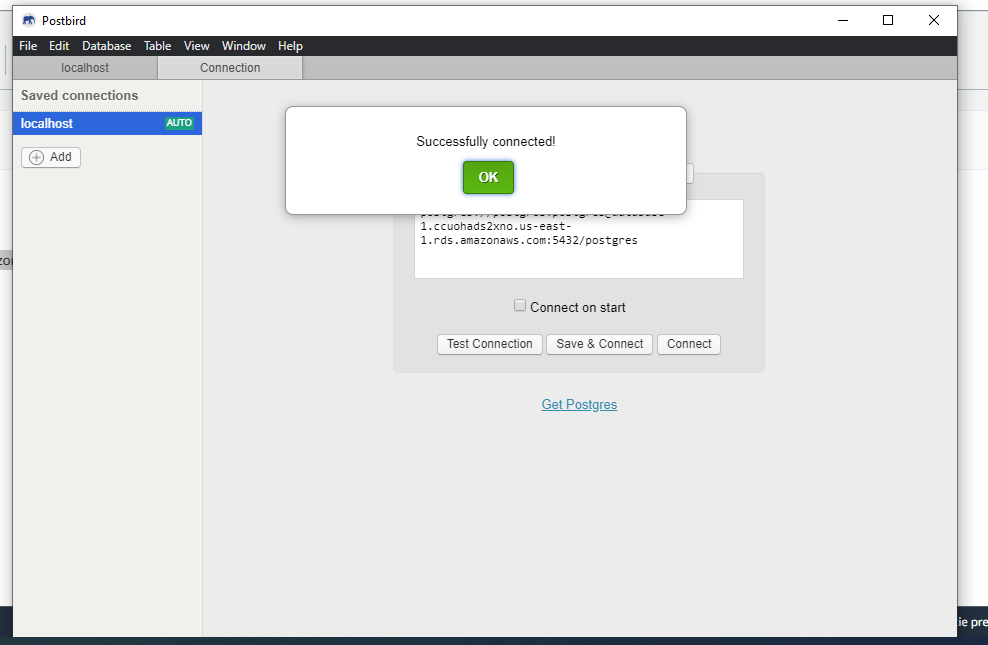
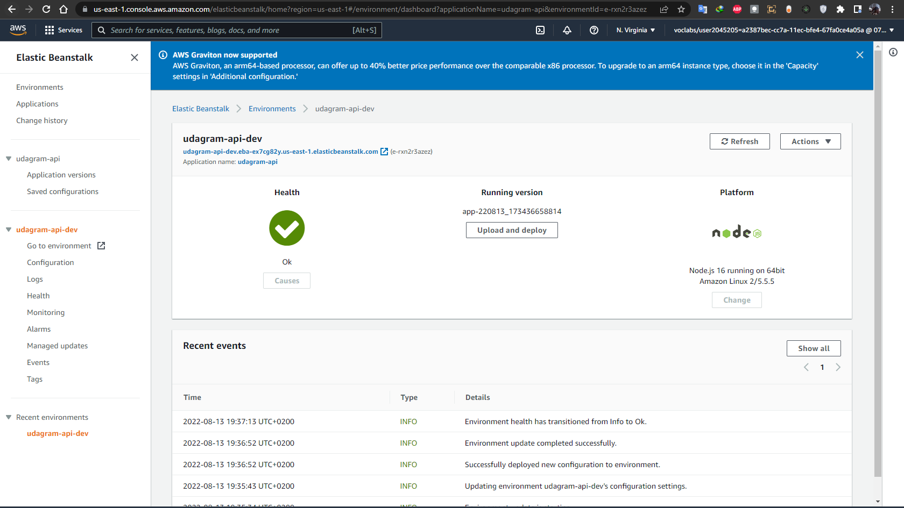
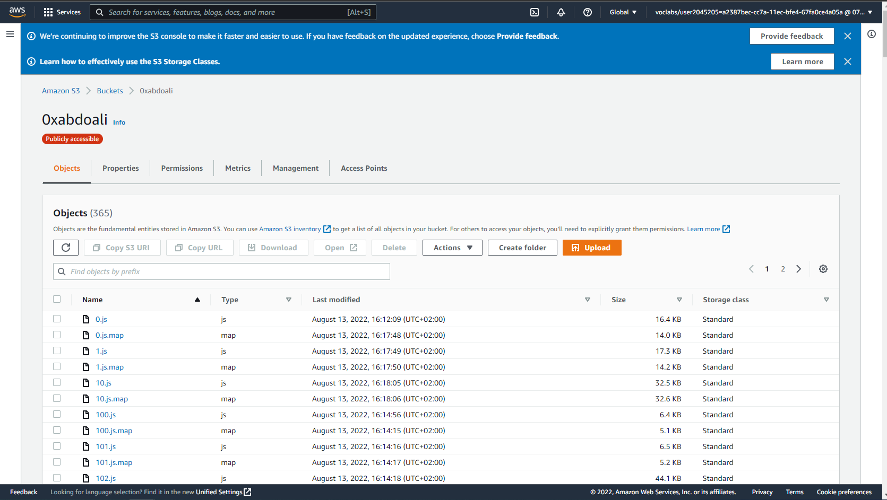

### AWS

* This website is being hosted on AWS.
* Elastic Beanstalk is used to set up the Backend API.
* S3 bucket for hosting frontend.
* RDS database running Postgres.

### screenshots:

* AWS RDS 

* AWS RDS Test Connection

* AWS Elastic beanstalk

* AWS S3 frontend bucket

