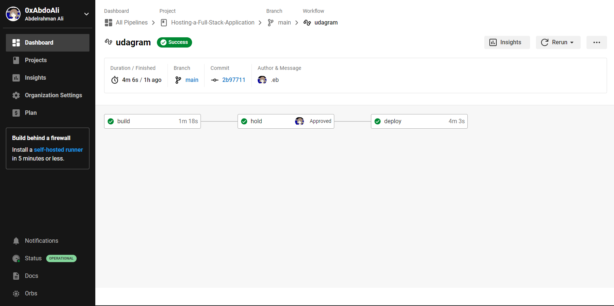
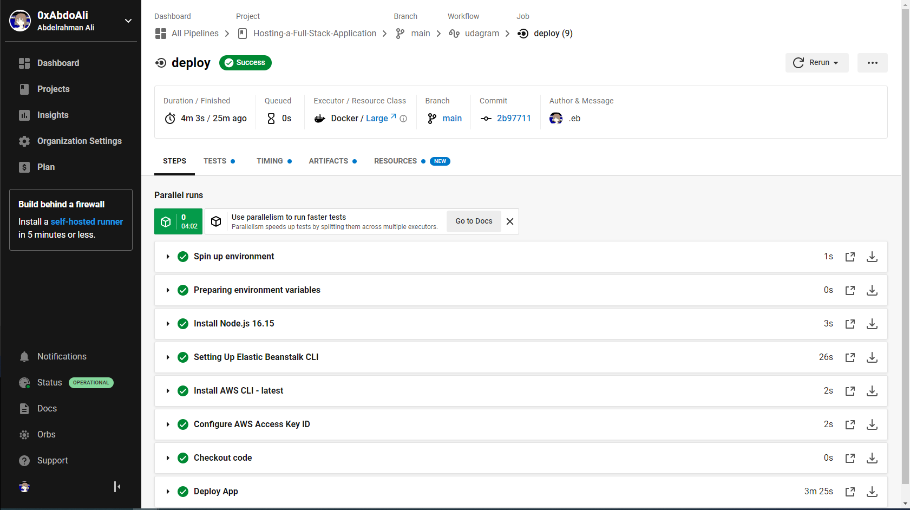
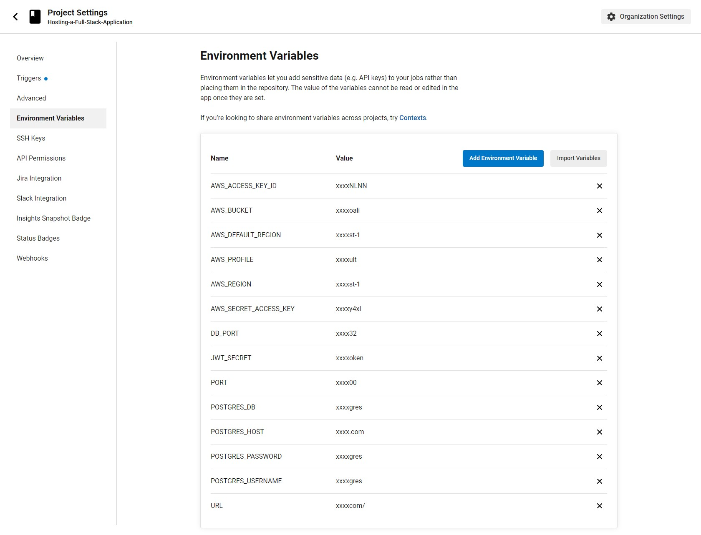

### CI/CD pipeline

- The CircleCi is linked to the project on Github.
- It is used to automatically deploy the website to the AWS.
- It is set to automatically execute once the code is being pushed into the main Github project.

- Pipline main steps
  

- circleci steps
  

- circleci environmentVariables

